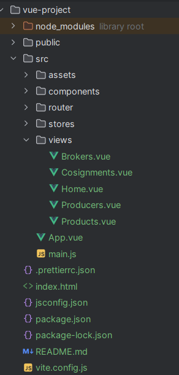
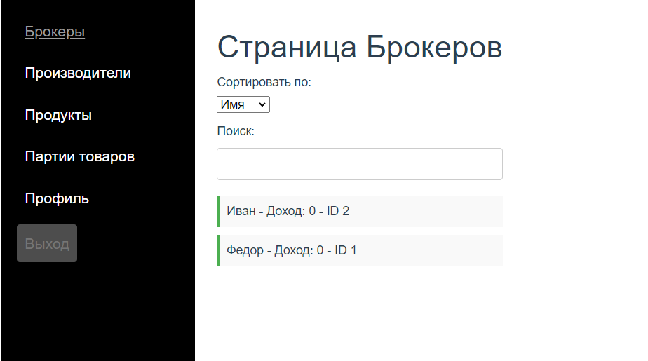
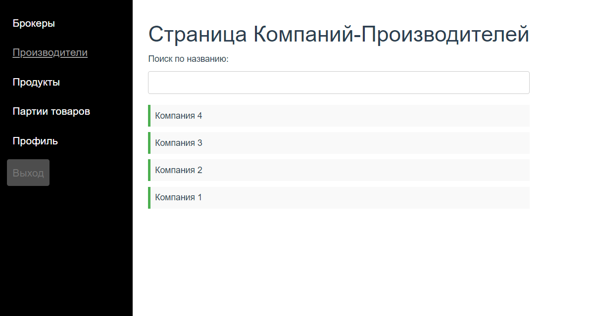
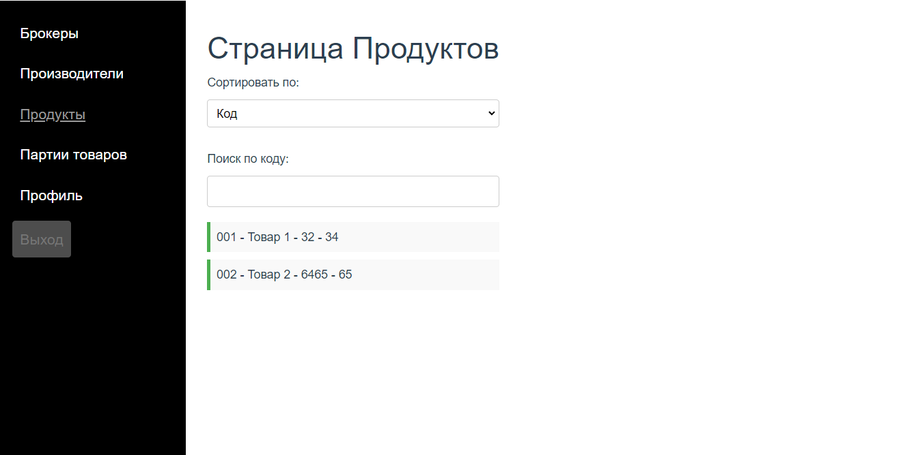
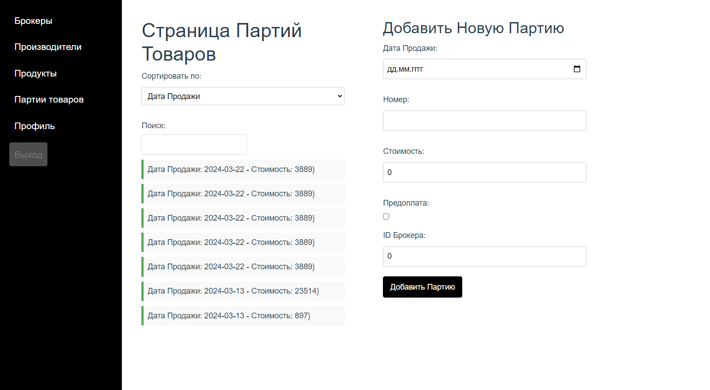

# Лабораторная работа 4. Реализация клиентской части средствами Vue.js.

## Страница Брокеров

### Описание
Страница представляет список брокеров с возможностью сортировки и поиска.

### Функции
- **Сортировка**: Пользователь может сортировать брокеров по имени или доходу.
- **Поиск**: Поиск брокеров по имени.

### Компоненты
- `<BrokerComponent>`: Отображает список брокеров с деталями.

### Методы
- `fetchBrokers()`: Получает список брокеров от сервера.
- `sortBrokers()`: Сортирует список брокеров в соответствии с выбранным параметром.
- `filterBrokers()`: Фильтрует список брокеров на основе введенного поискового запроса.

- ## Страница Продуктов

### Описание
Отображает информацию о продуктах, позволяет их сортировать и искать по коду.

### Функции
- **Сортировка**: Пользователи могут сортировать продукты по коду, названию, единице измерения и сроку хранения.
- **Поиск**: Поиск продуктов по коду.

### Компоненты
- `<ProductComponent>`: Показывает список всех продуктов с информацией о каждом.

### Методы
- `fetchProducts()`: Получает список продуктов от сервера.
- `sortProducts()`: Сортирует список продуктов в соответствии с выбранным параметром.
- `filterProducts()`: Фильтрует список продуктов на основе введенного поискового запроса.

- ## Страница Партий Товаров

### Описание
Страница для управления партиями товаров, включая добавление новых партий.

### Функции
- **Сортировка**: Пользователь может сортировать партии товаров по дате продажи или стоимости.
- **Поиск**: Поиск партий товаров по различным параметрам.

### Компоненты
- `<ConsignmentComponent>`: Управляет отображением и добавлением партий товаров.

### Методы
- `fetchConsignments()`: Получает список партий товаров от сервера.
- `addConsignment()`: Отправляет данные о новой партии на сервер.
